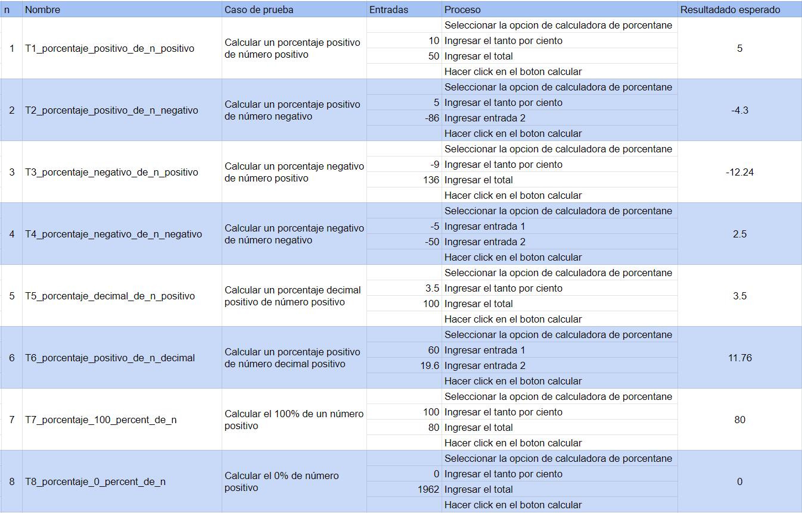
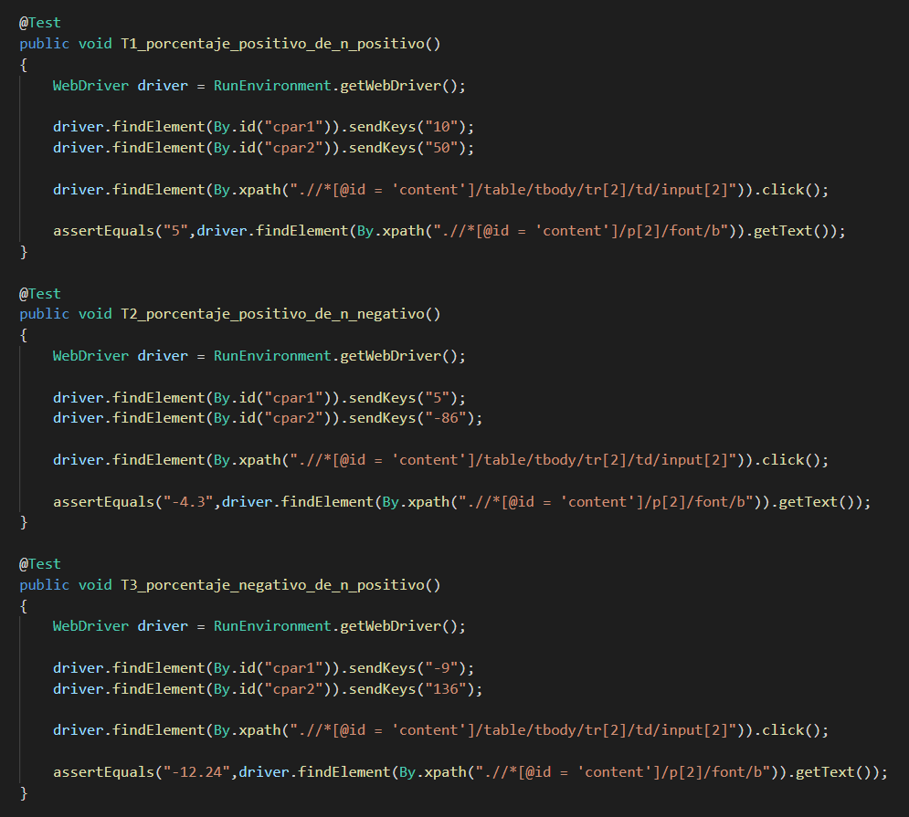
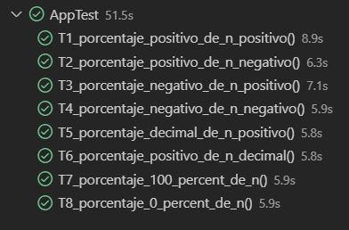
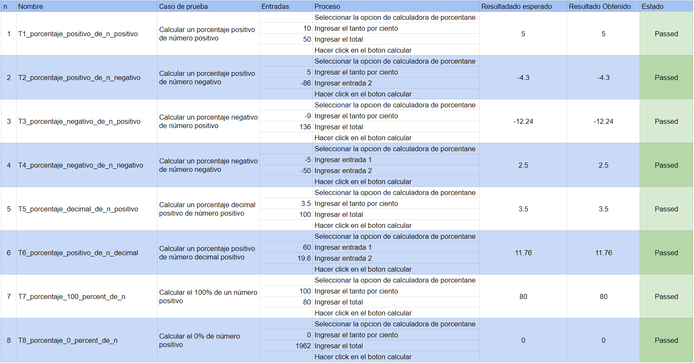

# Pruebas-unitarias-con-Selenium-y-JUnit

## Herramientas:

- VSCode
- Extension Pack for Java
- JUnit
- Maven
- MS Edge Driver

## Implementación de casos de pruebas:
### Diseño de casos de prueba

### Implementacion de [scripts de prueba](src/test/java/y35k3/AppTest.java)

### Ejecución de pruebas

### Reporte

